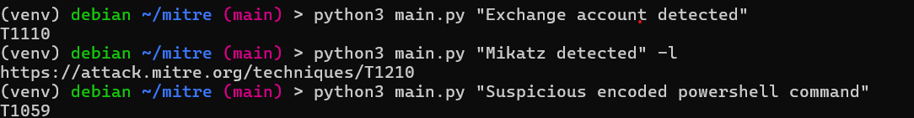

# An AI that map use cases name with Mitre Att&CK techniques

## Set up

1. Clone all repository listed in [Acknowledgments](#acknowledgments)
2. Install requirements.txt

## Examples: 


## Theory

### Single Class Classification
> Supposed that one rules name can only have one mitre technnique

GaussianNB
```            
Precision: 0.5455894095627782
Recall: 0.6323763955342903
F1: 0.6389246074030653
```

SVC
```            
Model evaluation
Precision: 0.5357550854252018
Recall: 0.7121212121212122
F1: 0.695978132355355
```

ComplementNB
```            
Model evaluation
Precision: 0.4482258623309422
Recall: 0.6363636363636364
F1: 0.5980927305198915
```

MultinomialNB
```            
Model evaluation
Precision: 0.18923977334201353
Recall: 0.46331738437001596
F1: 0.3851311586787331
```


BernoulliNB
```           
Model evaluation
Precision: 0.07316943930209778
Recall: 0.3373205741626794
F1: 0.2439527660736201
```

### Multiple Label Classficiation (MLC)
> Supposed that one rules name can have multiles mitre technnique

WIP 

## Acknowledgments
Sources of the trained dataset came from:
- https://github.com/SentineLabs/S1QL-Queries
- https://github.com/Azure/Azure-Sentinel/tree/master
- https://github.com/socfortress/Wazuh-Rules
- https://github.com/FalconForceTeam/FalconFriday?tab=BSD-3-Clause-1-ov-file#readme
- https://github.com/wazuh/wazuh/?tab=License-1-ov-file#readme
- https://help.fortinet.com/fsiem/Public_Resource_Access/7_1_2/rules/rule_descriptions.htm#rulesMitre
- Mitre Att&CK: https://attack.mitre.org/techniques

Others:
- Choice of the models: https://scikit-learn.org/stable/tutorial/machine_learning_map/index.html
